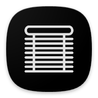
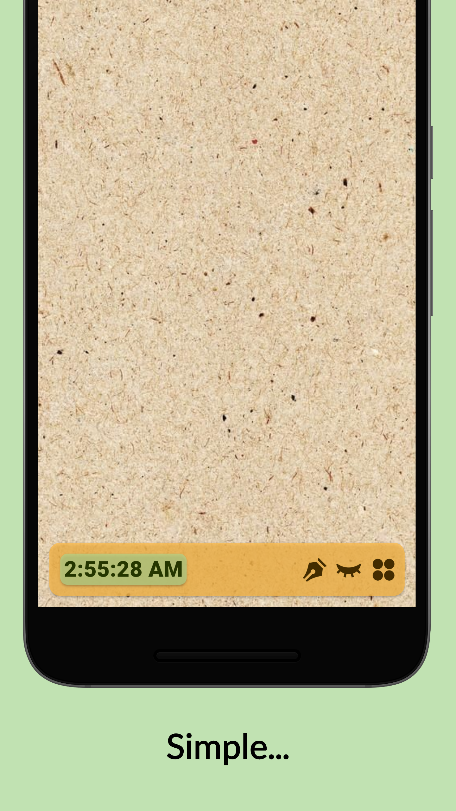
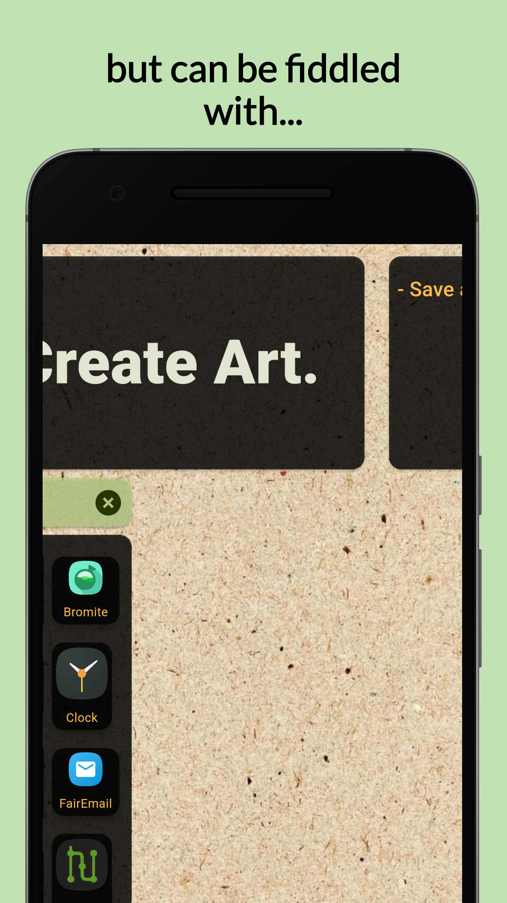

# Shelf

A simple Android App Launcher with simple gestures and productivity features; that can also be fiddled with.

## Features

- Easy and quick noting with a single note card
- Quick Web search from the App Drawer (Google)
- Gestures for easy accessibility

## Screenshots

## Contributions
- Welcome